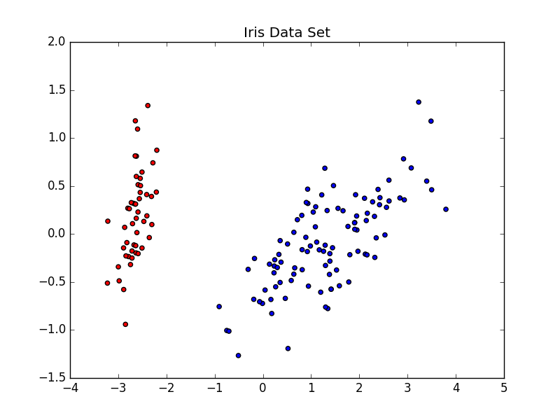

## Sample of the Iris Data Set

A small sample of the Iris Data Set only to test purpose. In this set, there are two labels (1.0 and -1.0, thats means, is binary) and each records is compose by two attributes.

The following image is the representation 2-dimensional  of this Data Set. The reds and blues points represents the label 1.0 and -1.0, respectively. 

